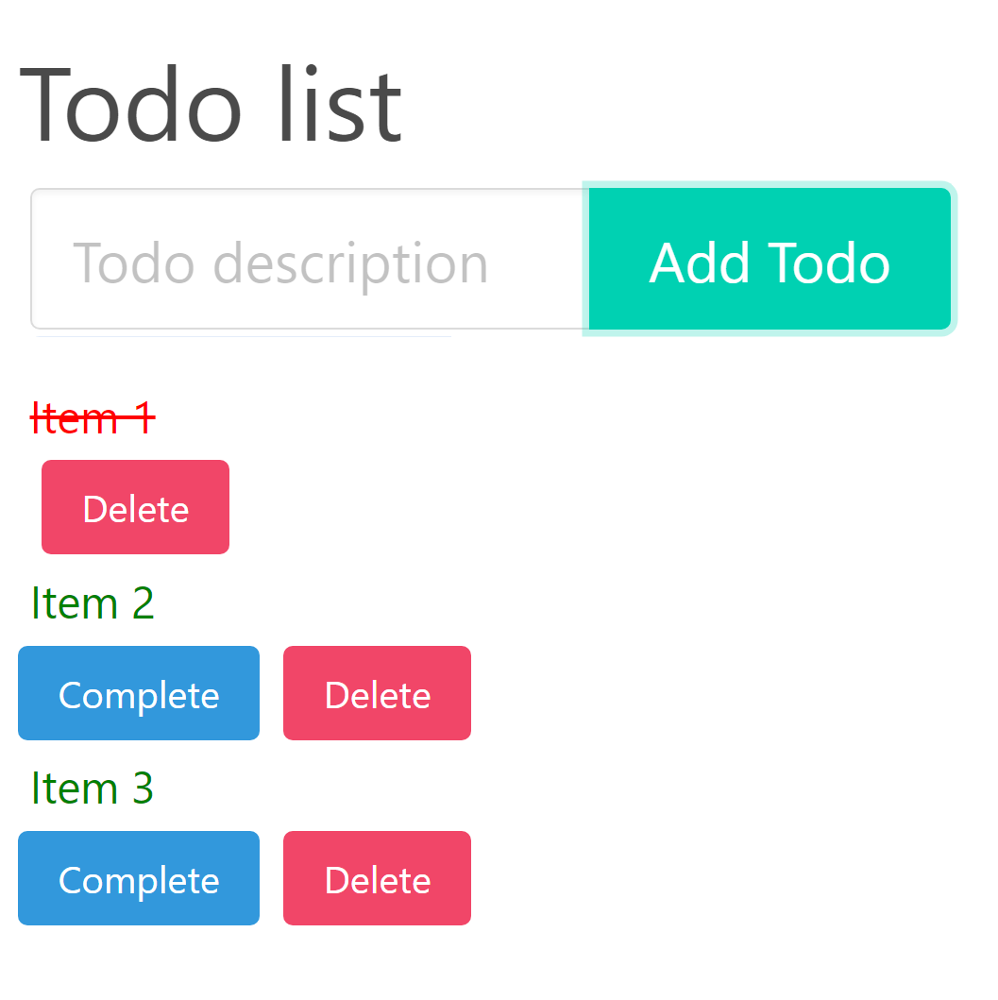

# todo-web
TODO web app written in Rust using Rocket, Diesel and Seed.

---
Start the backend using the following command:
```
cargo run -p backend
```
The frontend can be served using `microserver` in the `frontend` directory.



---
The structure of the web app closely follows https://erwabook.com/intro/.

Please have a look at [the Postman collection](todo_web.postman_collection.json) for the supported APIs.

